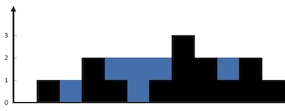

42. 接雨水

> https://leetcode.cn/problems/trapping-rain-water/description/?envType=study-plan-v2&envId=top-100-liked

给定 n 个非负整数表示每个宽度为 1 的柱子的高度图，计算按此排列的柱子，下雨之后能接多少雨水。

**示例 1**：
输入：height = [0,1,0,2,1,0,1,3,2,1,2,1]
输出：6
解释：上面是由数组 [0,1,0,2,1,0,1,3,2,1,2,1] 表示的高度图，在这种情况下，可以接 6 个单位的雨水（蓝色部分表示雨水）。

**示例 2**：
输入：height = [4,2,0,3,2,5]
输出：9

========== 题解 ==========
接水场景：类似于短板木桶，只有最低的那块板才能决定能盛多少水。

实现思路：

1. 那么高边就可以看为支撑，矮板来限定水量。
2. 在左或者右边找到高板，那么就记录左右两边的最高板。
3. 然后遍历矮的一边，这个时候能接多少水完全由矮边决定。
4. 当前位置的水量即为 （矮边最高板高度 - 当前板高度）。
5. 计算当前位置水量后累加到水总量并最终放回。

想象场景很重要，最开始可以从最简单的场景入手。
比如：
有三块板分别为 **[1, 0, 3]**,
那么就是 3 这块板固定，在 3(右边最高板) 的左边从左往右找到 矮边最高板，
这里为 1(左边最高板),
然后盛多少水就应该从这块 左边最高板 的右边寻找,
这里找到第二块板 0,
那么此时盛水量就为 左边最高板 1 - 当前板高度 0
